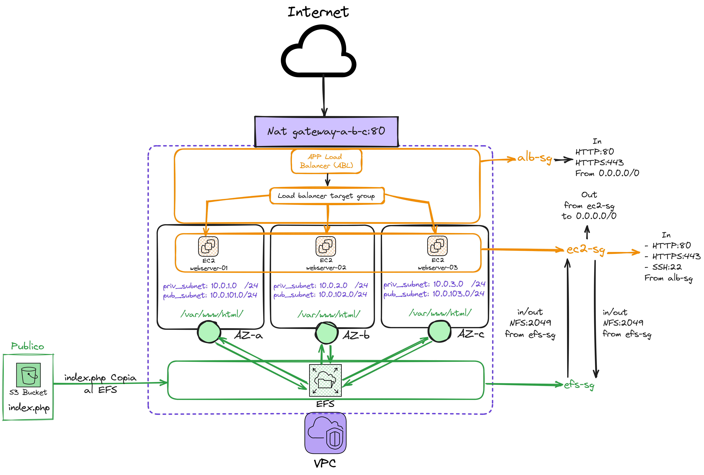

### Contenido del repositorio ☁️
Este repositorio contiene un conjunto de configuraciones de Terraform diseñadas para implementar una infraestructura completa en AWS. La infraestructura incluye una red VPC, instancias EC2, un sistema de archivos EFS, un balanceador de carga de aplicaciones (ALB) y un bucket S3. A continuación se describe brevemente cada componente y su función dentro de la arquitectura:

1. **Proveedor y Región de AWS:**
   - Se configura Terraform para utilizar el proveedor de AWS con la versión especificada y se establece la región `us-east-1`.

2. **Red VPC:**
   - Se crea una VPC (Virtual Private Cloud) con subredes privadas y públicas en tres zonas de disponibilidad (`us-east-1a`, `us-east-1b`, `us-east-1c`).
   - Se habilita un NAT Gateway para permitir el acceso a internet desde las subredes privadas.

3. **Grupos de Seguridad:**
   - Se definen varios grupos de seguridad para controlar el tráfico de red:
     - **Grupo de Seguridad para ALB:** Permite tráfico HTTP y SSH entrante desde cualquier IP.
     - **Grupo de Seguridad para EC2:** Permite tráfico HTTP y HTTPS desde el ALB y tráfico SSH desde cualquier IP.
     - **Grupo de Seguridad para EFS:** Permite tráfico NFS desde las instancias EC2.

4. **Sistema de Archivos EFS:**
   - Se crea un sistema de archivos EFS (Elastic File System) y se configuran puntos de montaje en cada una de las subredes privadas.

5. **Bucket S3:**
   - Se crea un bucket S3 para almacenar archivos, con acceso público configurado para servir contenido estático como un sitio web. Se incluyen un archivo `index.php` y un `error.html`.

6. **Instancias EC2:**
   - Se despliega una instancia EC2 administrativa que monta el sistema de archivos EFS y descarga un archivo `index.php` desde el bucket S3.
   - Se crean tres instancias EC2 adicionales que actúan como servidores web. Estas instancias montan el EFS y configuran un servidor HTTP para servir contenido web.

7. **Balanceador de Carga de Aplicaciones (ALB):**
   - Se configura un ALB para distribuir el tráfico HTTP entrante entre las instancias EC2. El ALB utiliza los grupos de seguridad configurados para permitir el tráfico HTTP.

8. **Salidas (Outputs):**
   - Se proporcionan varios outputs al final del despliegue, incluyendo la URL del sitio web en S3, el nombre DNS del balanceador de carga y el ID del sistema de archivos EFS.

Este conjunto de configuraciones proporciona una infraestructura escalable y segura para alojar aplicaciones web en AWS, utilizando las mejores prácticas de red y seguridad.

## Diagrama de la infraestructura


## [TF AWS Docs](https://registry.terraform.io/providers/hashicorp/aws/latest/docs) & [Module caching](https://medium.com/the-scale-factory/terraform-plugin-caching-a5e7a9322f35)

# Terraform comandos básicos
- terraform init
- terraform init --upgrade
- terraform plan
- terraform validate
- terraform apply -auto-approve
- terraform destroy -auto-approve

# Generar grafico de la IaaC
- terraform graph > graph.dot
- sudo dnf install graphviz
- dot -Tpng graph.dot -o graph.png

---
---

## Este ejercicio fue creado a partir de una actividad que sigue los siguientes parámetros:
1. Cada alumno, deberá enviar código que Terraform, que permita desplegar la siguiente infraestructura el AWS.
2. Cree una VPC, utilizando el módulo de AWS (terraform-aws-modules/vpc/aws) considerando el siguiente detalle:
```
module "vpc" {
    source = "terraform-aws-modules/vpc/aws"
    
    name = "my-vpc"
    cidr = "10.0.0.0/16"
    
    azs             = ["us-east-1a", "us-east-1b", "us-east-1c"]
    private_subnets = ["10.0.1.0/24", "10.0.2.0/24", "10.0.3.0/24"]
    public_subnets  = ["10.0.101.0/24", "10.0.102.0/24", "10.0.103.0/24"]
    
    enable_nat_gateway = true
    enable_vpn_gateway = false
    
    tags = {
        Terraform = "true"
        Environment = "prd"
    }
}
```

3. Cree un "`Security Group`" que permita conexiones al puerto tcp/80 (http), tcp/443 (https) y tcp/22 (ssh).
4. Cree un bucket S3, copie el siguiente archivo “`.php`”:

```php
<html xmlns="http://www.w3.org/1999/xhtml" >
    <head>
        <title>My Website Home Page</title>
    </head>
    <body>
        <h1>Welcome to my website</h1>
        <p>Now hosted on: <?php echo gethostname(); ?></p>
        <p><?php $my_current_ip=exec("ifconfig | grep -Eo 'inet (addr:)?([0-9]*\.){3}[0-9]*' | grep -Eo '([0-9]*\.){3}[0-9]*' | grep -v '127.0.0.1'");
        echo $my_current_ip; ?></p>
    </body>
</html>
```
5. Lanze 3 Instancias Virtuales en EC2, cada una en una AZ distinta (availability zone) y en las subredes públicas disponibles. Para cada una de estas instancias, asocie la llave de usuario (Key user) "vockey" y el "Security Group" configurado en el punto 1.
6. Lance un volumen EFS y montelo dentro de cada una de las instancia EC2 en el path /var/www/html.

7. Instale el servicio webserver (apache) y php en cada instancia EC2 (Puedes usar “EC2 user data” para realizar esto.
    ```sudo yum install -y httpd php```

8. Copie desde el bucket S3, el archivo “index.php” hacie el path /var/www/html (EFS). 
9. Cree un Balanceador de Carga (ALB) en AWS adjuntando las 3 máquinas creadas antes como targets. Este LB también debe aceptar conexiones en el puerto 80 desde cualquier dirección IP. 